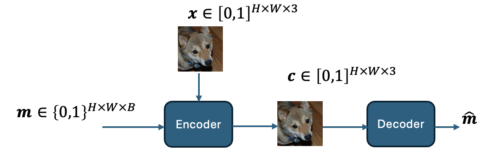

# Neural Cover Selection for Image Steganography
This repository contains the code for our paper "Neural Cover Selection for image Steganography" by Karl Chahine and Hyeji Kim (NeurIPS 2024).

# Paper Summary
Image steganography embeds secret bit strings within typical cover images, making them imperceptible to the naked eye yet retrievable through specific decoding techniques. The encoder takes as input a cover image ***x*** and a secret message ***m***, outputting a steganographic image ***s*** that appears visually similar to the original ***x***. The decoder then estimates the message ***m̂*** from ***s***. The setup is shown below, where _H_ and _W_ represent image height and width respectively:

    

The effectiveness of steganography is significantly influenced by the choice of the cover image x, a process known as cover selection. Different images have varying capacities to conceal data without detectable alterations, making cover selection a critical factor in maintaining the reliability of the steganographic process.

Traditional methods for selecting cover images have three key limitations: (i) They rely on heuristic image metrics that lack a clear connection to steganographic effectiveness, often leading to suboptimal message hiding. (ii) These methods ignore the influence of the encoder-decoder pair on the cover image choice, focusing solely on image quality metrics. (iii) They are restricted to selecting from a fixed set of images, rather than generating one tailored to the steganographic task, limiting their ability to find the most suitable cover.

In this work, we introduce a novel, optimization-driven framework that combines pretrained generative models with steganographic encoder-decoder pairs. Our method guides the image generation process by incorporating a message recovery loss, thereby producing cover images that are optimally tailored for specific secret messages. We investigate the workings of the neural encoder and find it hides messages within low variance pixels, akin to the water-filling algorithm in parallel Gaussian channels. Interestingly, we observe that our cover selection framework increases these low variance spots, thus improving message concealment.

The DDIM cover-selection framework is illustrated below: 

# What's in this repo

